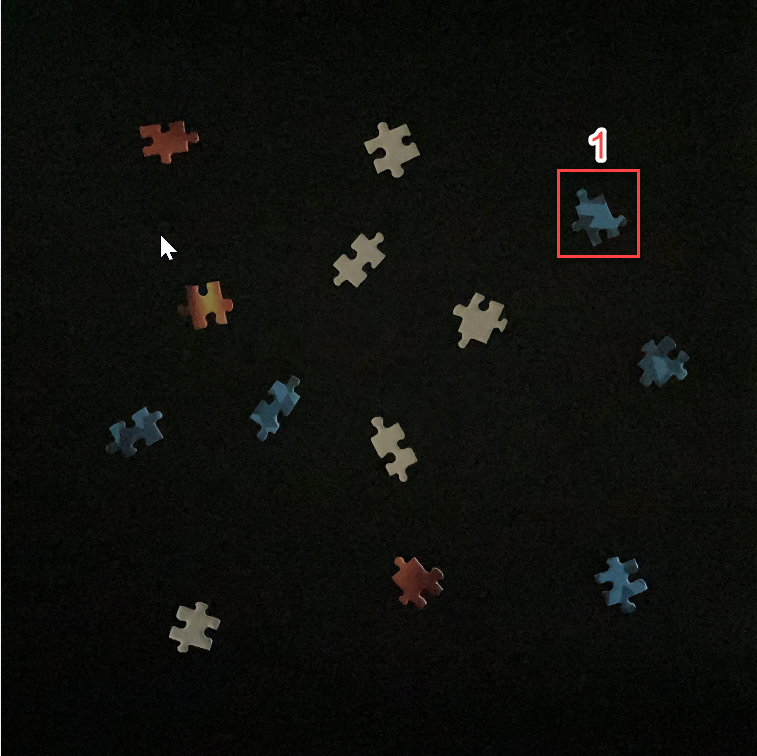

## Concept Check: Exploring Images

### Question 1

The concrete crack images have a resuolution of 227x227 pixels.

If each pixel of data type `uint8` has a size of one byte, how large (in bytes) will a 227x227 grayscale images of type uint8 be?

$227\times{227}=51529\text{ bytes}$

### Question 2

How large (in bytes) will the grayscale crack image be if converted to data type uint16

$227\times{227}=51529\text{ bytes}\times{2}=103058\text{ bytes}$

> Despite its larger size compared to images of type `uint8`, imagse of type `uint16` still requiere far less storage space than images of type `double`

# Question 3

The next trhee questions will use the image "PuzzleBadLightning.jpg"

Load the image using `imread` and display it using `imshow`. THe pixel from 604th row and the 411th column of the image is olocated on an orange puzzle piece. What are this pixel's red, green, and intensity values?

- 22; 23; 18
- 153; 123; 22
- 145; 114; 28
- **131; 114; 60**
- 60: 114: 131

### Question 4

It can be hard to predict what the combination of red, green, and blue intensity values will look like to the human eye.
Open "PuzzleBadLighting.jpg" in the Image Viewer App. Use the zoom and inspect pixel values tools to examine puzzle piece 1. Which pixels have higher blue intensity values, the dark blue portions or the light blue portions of this piece?

- Dark Blue
- **Light Blue**

> Brighter pixels tend to have higher intensity values for across all compred to darker pixels.

### Quesiton 5

Compare puzzle piece 1 to puzzle piece 2. Which has a higher blue intensity value, the dark blue portion of puzzle piece 1 or puzzle piece 2?

- Dark Blue Puzzle Piece 1
- Puzzle Piece 2

> Correct. This puzzle piece is significantly brighter. Even though it does not appear blue, brighter pixels tend to have higher intensity values across all borders.
