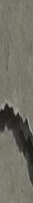
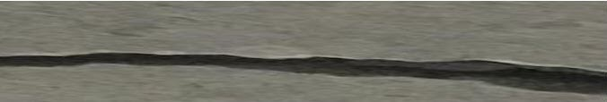
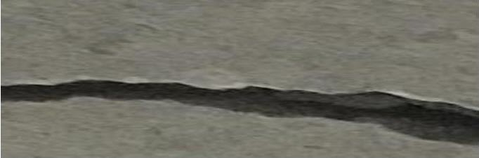
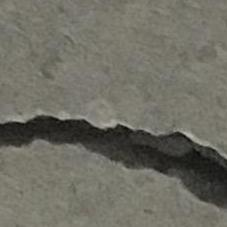

## Concept Check: Working with Image Data

### Question 1

The next two questions use the vectors `x` and `y` defined below,

```matlab
X = [229 51 222; 21 33 15; 179 41 219];
y = [167 162 17; 202 29 38; 47 51 31];
```

> Negative numbers aren't permitted in data type `uint8` and become 0

### Quesiton 2

What is the result of `x - y` if the variables are type `uint8`?

- `[62 111 205; 181 4 23; 132 10 188]`
- This operation results in an error
- `[62 -111 205; -181 4 -23; 132 -10 188]`
- `[62 0 205; 0 4 0; 132 0 188]`

> Images of type `double` are permitted to be negative

### Question 3

Consider the 227x227 resolution concerte crack image, `img`:


What will the result of `imresize(img, [114 681])`

- 
-  - ANSWER
- 
- 

> The resized image has fewer rows and far more columns
