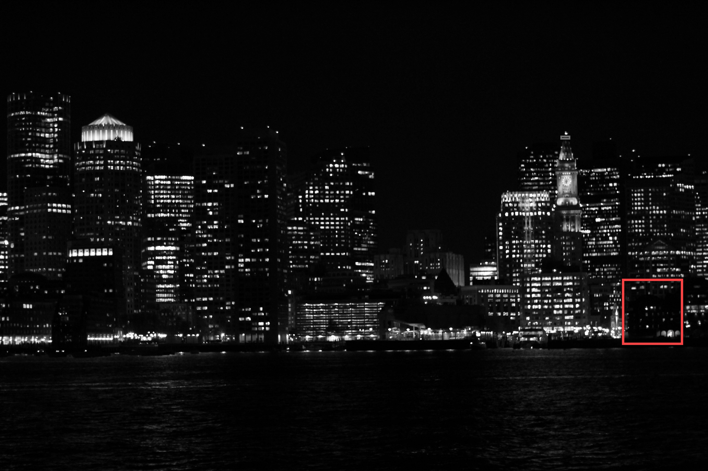
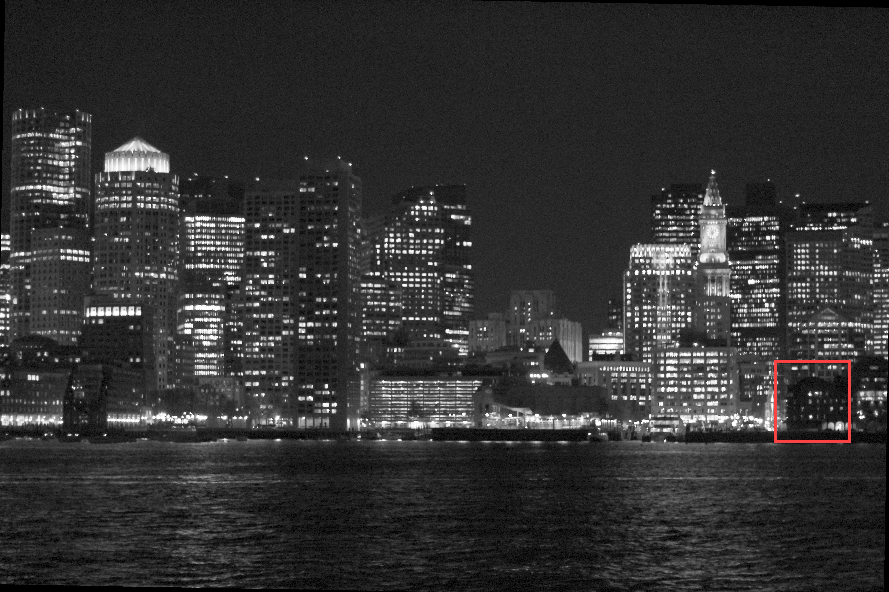
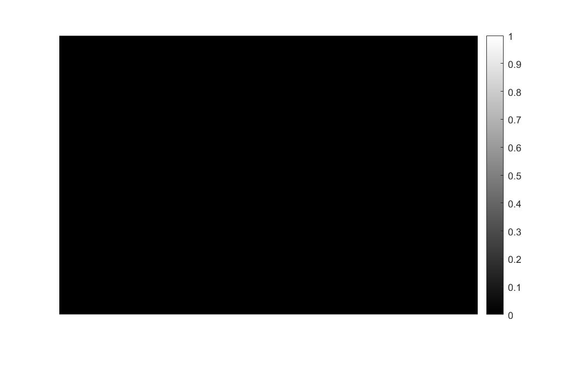
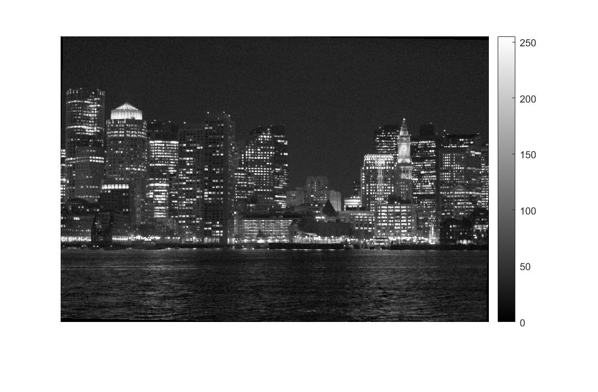
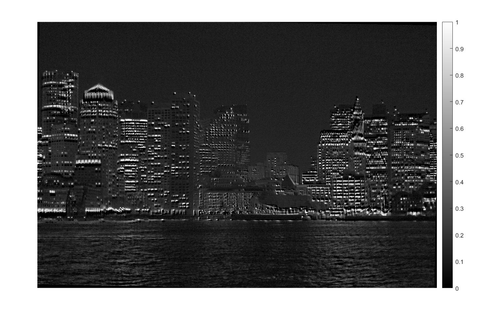
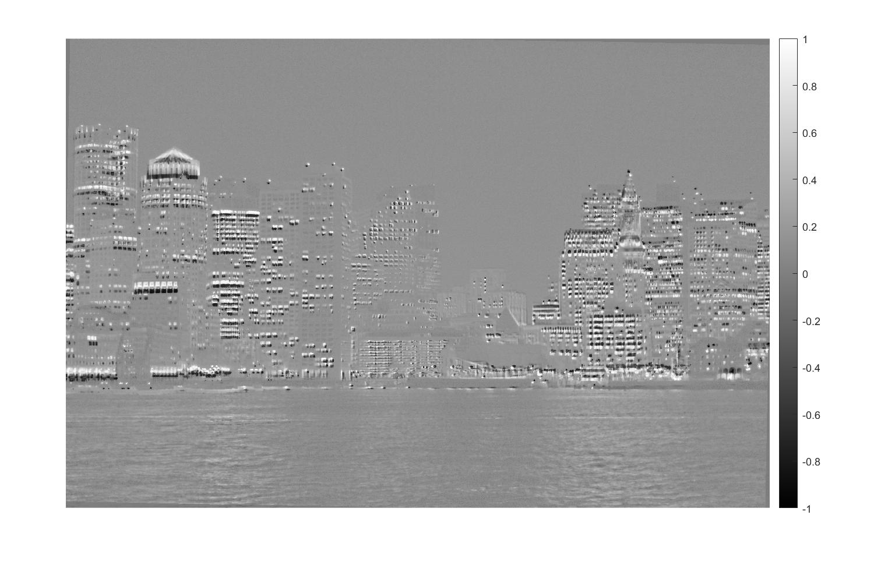
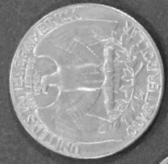
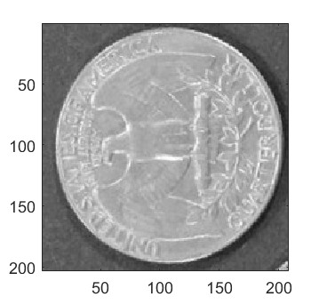

## Practice Quiz: Working with Image Data

### Question 1

The concrete check images you've been working with are 227x227 `uint8` color images.
If each pixel of type `uint8` in each color plane is one byte, how large(in bytes) will each image be?

> Bytes for one color plane = $227\times{227}=51529\text{ bytes}$ $\\$ Total bytes for the image = $51529\times{3}=154587\text{ bytes}$ $\\$ Each $227\times{227}\text{ uint8}$ color image will be $154587\text{ bytes}$

### Question 2

Consider saving one of the concrete crack images. Correctly order the resulting image files from smallest to largest file size.

```matlab
ANSWER
imwrite (img, "img.jpg", "Quality",0.8)
imwrite (img,"img.jpg","Quality",70)
imwrite (img,"img.png")
```

```matlab
imwrite (img, "img.jpg", "Quality",70)
imwrite (img,"img.jpg", "Quality",0.8)
imwrite (img,"img.png")
```

```matlab
imwrite (img,"img.png")
imwrite (img,"img.jpg", "Quality",70)
imwrite (img, "img.jpg", "Quality",0.8)
```

```matlab
imwrite (img,"img.png")
imwrite (img, "img.jpg","Quality",0.8)
imwrite (img, "img.jpg", "Quality",70)
```

### Question 3

The next 2 questions concern the image that you modified in this week's project.

In this week's project, you applied gamma correction to improve visibility in "boston night.jpg". Details that were previously hard to see are now much clearer. Consider the building shown below (inside the red box). It was extremely difficult to see before gamma correction (top), but now can be easily spotted (bottom).

Open the gamma-adjusted image in the Image Viewer app. Use the "Measure Distance" tool to determine approximately how tall (in pixels) this building is.

- 
- 

### Question 4

Assume you want to visualize the difference between the gamma corrected and rotated image and the original grayscale image. Which figure below correctly displays the difference between the two images?

- 
- 
- 
-  - ANSWER

### Question 5

How would you ensure that the eagle is oriented with its head at the top and feet at the bottom in the following coin image?



- **`img = imrotate(img, -90)`**
- `img = imflip(img, "right")`
- `img = imflip(img)`
- `img = imrotate(img, 90)`

### Question 6

The quarter image from the last question has a resolution of 203x203. Which command would give you a cropped image of just the eagle's head?



- imshow(img (40:70), img (85:115))
- imshow(img (90,:))
- **imshow(img (85:115,40:70))**
- imshow(img (90,55))
- imshow(1:203,1:90)

### Question 7

Camera exposure time is an important component of astrophotography.

Exposure time is stored as part of the "DigitalCamera" structure in an image's meta-data. Find the exposure time for `half moon jpg`. Enter your answer as a decimal.

0.0167
