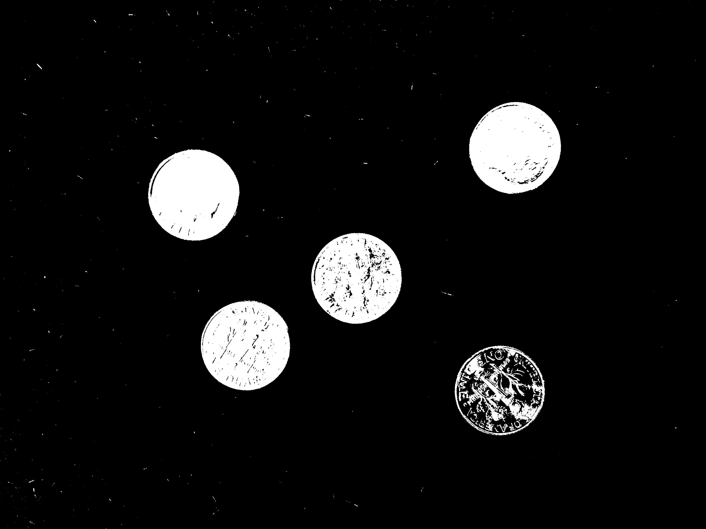
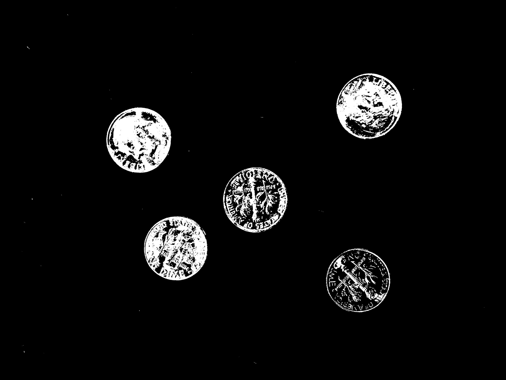
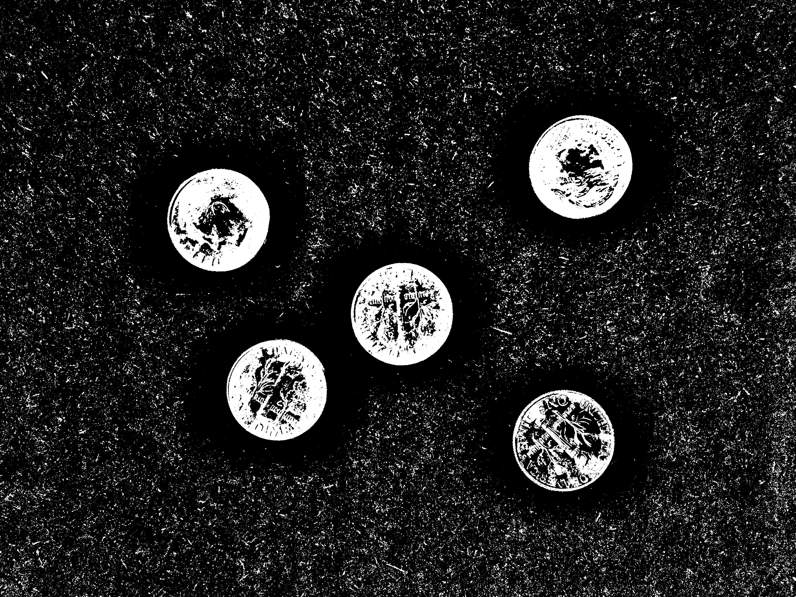
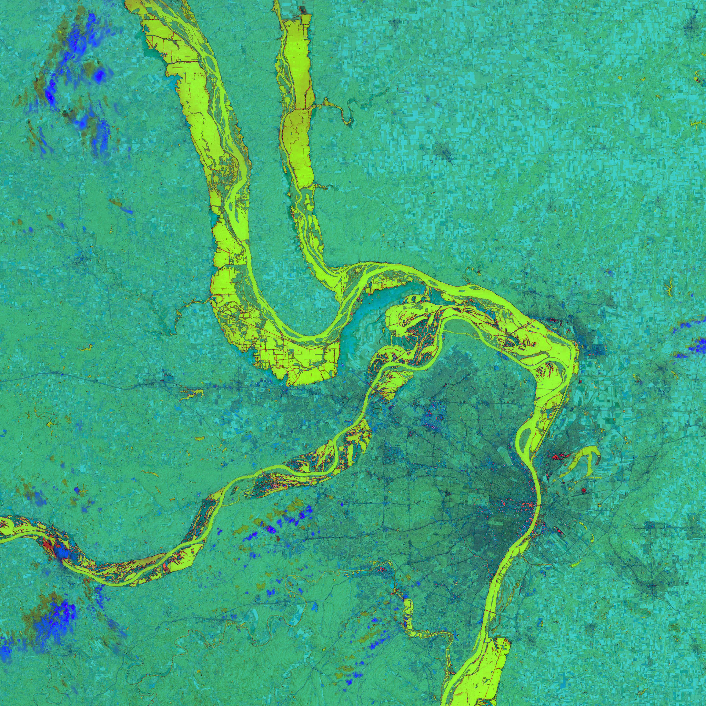

## Thresholding Images

### Question 1

Imagine you have a camera set up to capture snapshots of an outdoor scene throughout the day. Which approach is best to segment out the background in these shots?

- Multilevel threshold using two threshold values
- Global threshold
- **Adaptive threshold**

> The background lightning would be different throughout the day, so an adaptive threshold would make the most sense here.

### Question 2

For questions 2-6, you will be working with this grayscale image of coins, shown below. Right click on the image and save it with your files so you can import it into MATLAB.

Determine the global threshold calculated from Otsu's method. What is the threshold intensity value? Express your answer as an integer between 0 and 255.

143

> You can use `graythresh` to determine the threshold value in decimal form, ant then multiply the value by 255 to get the integer representation

### Question 3

Using the threshold value from the previous question, segment the image. How many true pixels are in the resulting segmented binary image?

594617

> The number of true pixels can be counted using the `nnz` function

### Question 4

What is the effectiveness metric for the dimes image? 0.6967

> The effectiveness metric can be calculated using `graythresh` function

### Question 5

Now segment the same image using an adaptive threshold. Which of the following imags looks most like the result?

- 
- 
-  - ANSWER

> This the result using an adaptive threshold

### Question 6

Which of the following can only be done with a multilevel threshold (as opposed to an adaptive or global threshold)?

- **Isolating three objects, each with their own distinct intensity**
- Isolating the foreground from the background in an image
- Isolating the foreground from the background, but you have inconsistent lighting in your image

### Question 7

You are working with a satellite image of a flood on a green landscape, but when the showing the image using `imshow`, you unexpectedly saw this:

What's the best possible reason for this?

- **You converted to a different color space and forgot to convert back to RGB before using imshow.**
- You accidentally changed the data type of the image into double, but the values are all the same.
- You accidentally inverted the image colors.

> The imshow function accepts any uint8 or double 3d matrices with three layers, but assumes the values are in RGB, so passing in an HSV, YCbCr, or L\*a\*b\* image leads to strange results.

### Question 8

In Thresholding Color Images, you saw how to threshold the blueberries image ("blueberries.jpg") in HSV. Now, try performing the same thresholding in `L*a*b*` and `YCbCr` and compare those segmentations. Which color space do you prefer? Share your thoughts in the forums!

- L*a*b\*
- YCbCr
- **HSV**
