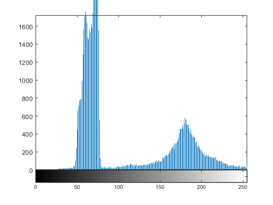
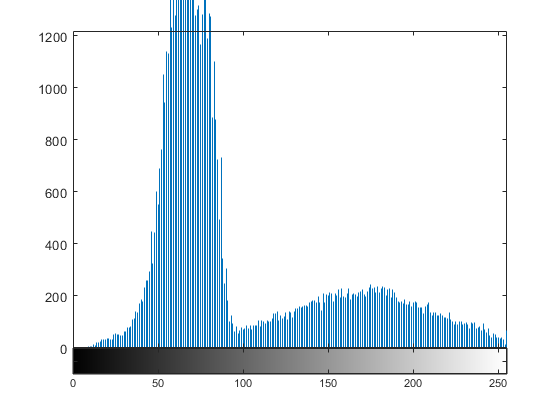
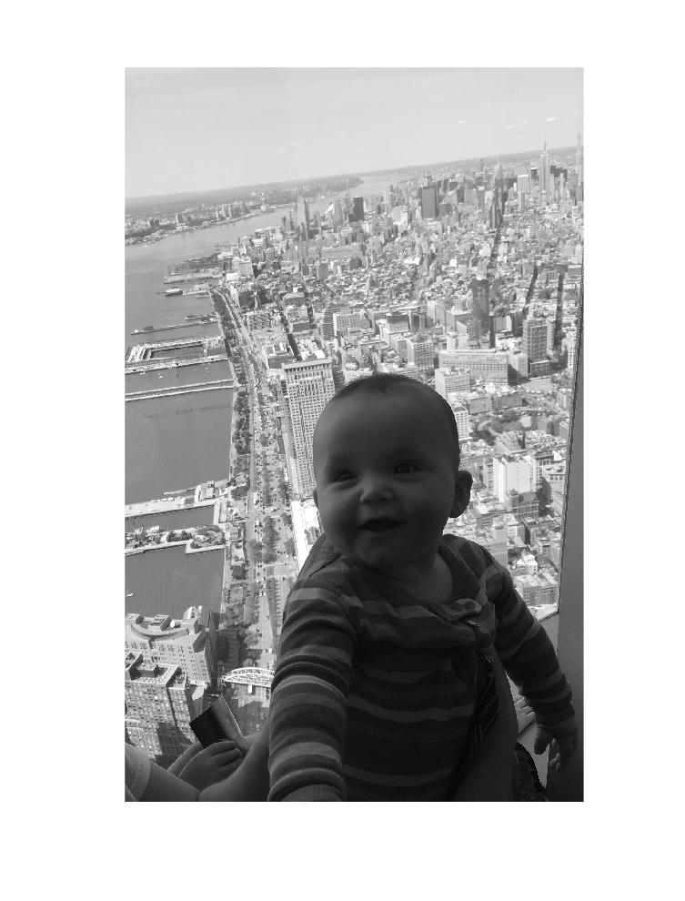
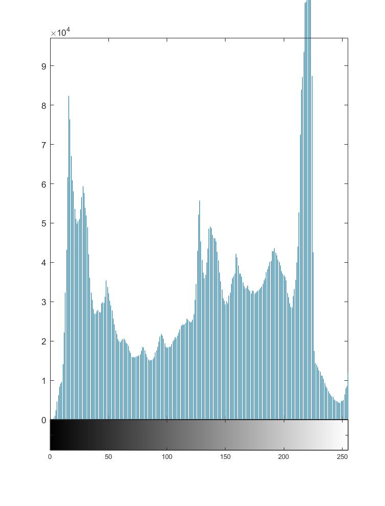

## Practice Quiz: Image Adjustment and Enhancement Concept Check

### Question 1

Which contrast adjustment technique has been used to adjust this image?

Before $\\$ 

After $\\$ 

- Histogram stretching (`imadjust`)
- Histogram equalization (`histeq`)
- Adaptive histogram equalization (`adapthisteq`)
- Local brightness enhancement (`imlocalbrighted`)

### Question 2

Which contrast adjustment method would most likely improve this image's contrast?

- `imadjust`
- `histeq`
- **`adapthisteq`**

> Breaking the image into tiles will result in some regions being very dark and others veing very bright. Equalizing these tiles will brighted the darker areas and arken the bright areas.

- **`imlocalbrighten`**

> This image has a large, dark region in the foreground that will become much clearer if that area is brightened.

### Question 3

In the More Examples of Color Manipulation section of the Enhancing Images reading, why don't any of the contrast adjustment methods have much effect on the lightouse image?

> All three of the Hue, Saturation, and Value planes have relatively uniform histograms. Stretching and equalizing them will not change them significantly. Since the image is so uniform in terms of saturation and value, breaking the image into tiles will not create bright or dark tiles that can be equalized.
