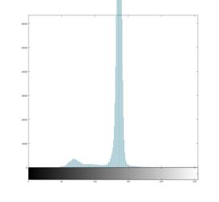
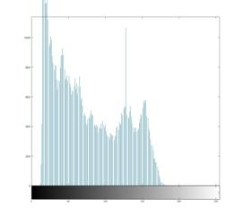
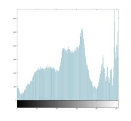
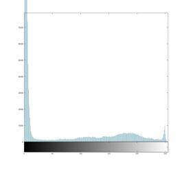

## Practice Quiz: Image Contrast and Histogram Concept Check

### Question 1

Which of the following best describes image contrast?

- The ratio of vertical columns of pixels to horizontal rows.
- **The visual distinction between the light and dark areas of an image.**
- The difference between the lightest and darkest pixel value in an image.
- The ratio of the number of pixels with the brightest value to the number of pixels with the darkest value.

### Question 2

Which of the following histrograms bet matches this image?

- 
- 
-  - ANSWER
- 

> Notice how the bright white of the tower and the clouds contain many pixels in the brightest part of the histogram.

### Question 3

Thresholding segments a grayscale image according to brightness values. The details of how imbinarize chooses a threshold are beyond the scope of this course, but looking at an image histogram, it is sometimes possible to guess a good threshold value. Which of the following threshold values do you think would produce the best segmentation for this image?

- **Threshold = 98/255 = 0.3842 $\\$ **
- Threshold = 127/255 = 0.5000 $\\$ 
- Threshold = 32/255 = 0.1255 $\\$ 
- Threshold = 165/255 = 0.6471 $\\$ 

> That thresholds procues best segmentation. It does a very good job in the lower, lighter region.
