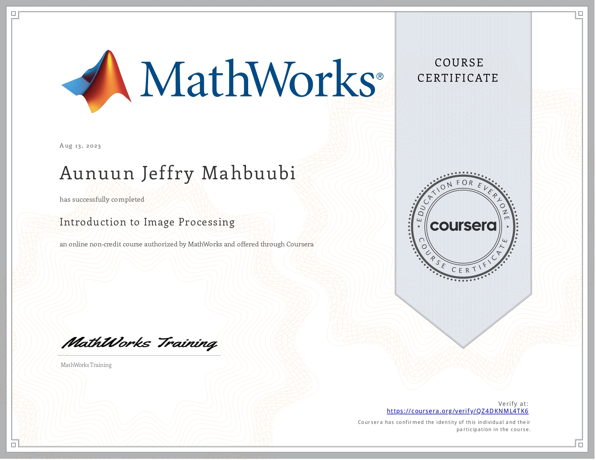

## [Introduction to Image Processing](https://www.coursera.org/learn/introduction-image-processing?specialization=image-processing)

### Modules List

- Introduction to Digital Images
- Working with Image Data
- Thresholding Images
- Adjusting Image Contrast

### Skills you will gain

- Image Processing
- Image Segmentation
- Matlab
