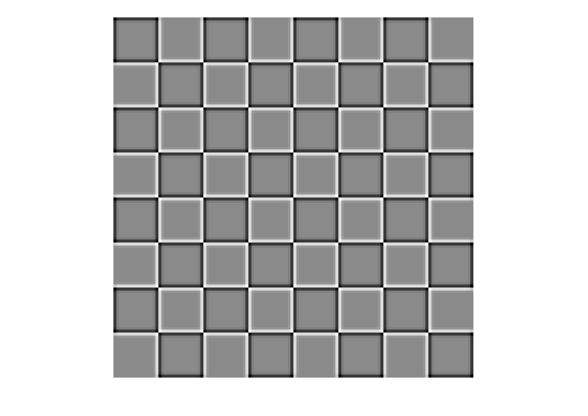

## Module 1 Quiz

### Question 1

#### Question 1 and 2: Working with Test Paterns

One way to get a feel for how spatial filters affect an image is to apply them to very simple test patterns. The following chechkerboard pattern is composed of alternating 16-by-16 pixel squares.


You can create this image in MATLAB with the following commands:

```matlab
A = ones(16);
B = zeros(16);
C = [A, B; B, A];
C = [C, C; C, c];
img = [C, C; C, C];
```

#### Spatial Filters

Which of the following images is the result of applying a 3x3 averaging filter to this image?

- 
-  **- ANSWER**
- 
- 

### Question 2 - Edge Detection

Which of the following images is the result of applying Canny edge detection to the chechkerboard image?

- 
- 
- 
-  **- ANSWER**

### Question 3 - Visualizing Gradients

Load the `coins.png` image included with MATLAB. Detect edges using the edge function with the Sobel method, and return the vertical and horizontal gradients.

Which image best represents the gradient which highlights the vertical edges in this image?


- 
- 
-  **- ANSWER**
- 

### Question 4 - Detecting Edges in Coins

Load the `coins1.jpg` image and resize it to a resolution of 600 by 800 pixels. Apply a Gaussian filter with a standard deviation of 0.5. Which of these images shows the edges detected by the 'edge' function with the canny method?


- 
-  **- ANSWER**
- 
- 

### Question 5 and 6: Counting Coins

The next two questions involve using the imfindcircles and viscircles functions. For each question, you will need to load the image, resize it, and apply the specified Gaussian blur with the imgaussfilt function.

#### Counting Coins 1

Load the `coins3.jpg` image and rescale the image to 600 by 800 pixels. Blur the image using a Gaussian blur with a standard deviation (`sigma`) of 1. Use the `imfindcircles` function to find only the four largest coins. What is the lower value of the radius search to eliminate the smaller coins? **60.1748204474961**

#### Counting Coins 2

Load the `coins2.jpg` image and rescale the image to 900 by 1200 pixels. Blur the image using a Gaussian blur with a standard deviation (`sigma`) of 1. Use the `imfindcircles` function to count the number of coins with radius less than 100.

**8 Coins**
