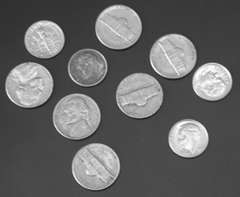

## Practice Quiz: Using the Image Segmenter App Quiz

### Question 1

For the question in this quiz, you will be loading images into the Image Segmenter App. In each case, when prompted to "Adjust Image", you need to click "Yes" to get the correct results.

Use the following code to load and view an image of text data included with your version of MATLAB. Notice the illumination is very uneven.

```matlab
textImage = imread("printedtext.png");
imshow(textImage)
```


Using the Image Segmenter App, which approach below gives you the following segmented image?

- **Adaptive Threshold with a bright Foreground Polarity and a Sensitivity value of 90**
- Manual Threshold with a value of of 200
- Global Threshold
- Adaptive threshold with a bright foreground polarity and a Sensitivity value of 50
- Manual threshold with a Threshold value of 60

> An addaptive threshold is required due to uneven illumination. A Sensitivy value of 90 works well to sepearte out the text from the background.

### Question 2

Use the following code to load, conver to grayscale, and view an image of a crack included with your course files.

```matlab
crackImage = imread("00162.jpg");
crackImage = im2gray(crackImage);
imshow(crackImage)
```


Which approach or approaches below will prdouce the following mask (select all approaches that work)?


- **ANSWER**
  1. Global Threshold
  2. Invert mask
  3. Close mask with a disk of radius 3
  4. Open mask with a disk of radius 3

> Correct! This is one of the two correct sets of steps here.

$\\$

- 1. Global Threshold
  2. Invert Mask
  3. Close mask with a disk of radius 3
  4. Erode mask with a disk of radius 3
  5. Dilate mask with a disk of radius 3

$\\$

- 1. Adaptive Threshold with bright Foreground Polarity and a sensitivity of 90
  2. Erode mask with a disk of radius 4
  3. Fill holes
  4. Invert mask

$\\$

- 1. Manual Threshold with a value of 57
  2. Invert mask
  3. Close mask with a disk of radius 3

### Question 3

Use the following code to load and view an image of coins included with MATLAB

```matlab
coinImage = imread("coins.png");
imshow(coinImage)
```



Next, open the Image Segmenter app, load the image from the workspace, and choose "Yes" when prompted for contrast adjustment.

Which approach or approaches below will segment the coins as foreground with no holes, negligible missing foreground, and no extra foreground artifacts:


- Manual Threshold with a Threshold value of 64.
- **Auto Cluster, then Fill Holes**

> Correct! This is one of the two correct approaches here.

- Find Circles with the following settings:
  - Min Diameter: 50
  - Max Diameter: 150
  - Number of Circles: Inf
  - Foreground Polarity: bright
  - Sensitivity: 0.85
- **Find Circles with the following settings:**

  - Min Diameter: 30
  - Max Diameter: 150
  - Number of Circles: Inf
  - Foreground Polarity: bright
  - Sensitivity: 0.90

  > Correct! All the coins in this image are well between 30 and 150 pixels in diameter. This is one of the two correct approaches here.

### Question 4

Now assume you want to segment only the nickels (the larger of the two types of coin in this image). Can you find one or more ways that work?

- **Use Find Circles to find all the circles. Then use the "open" morphological operator with a disk shape and radius of 26.**

> Correct. Choosing a structuring element that is large enough to cover the small coins but not the large coins will remove the small coins from the mask.

- Choose a manual threshold of 175 to differentiate between the two types of coins.
- **Use the Find circles approach with a minimum diameter of 55 pixels.**

> Correct. All of the smaller coins are below this threshold and will not be included in the mask.

- Auto Cluster, then Fill Holes

### Question 5

To apply an approach developed in the Image Segmenter app on other images, the best practice is to:

- Load an entire folder of images into the Image Segmenter App to apply the steps to all images at once.
- The Image Segmenter - App is meant for manual segmentation. You cannot repeat the process on other images.
- Write down the steps you took. Load other images into the app and repeat the steps.
- **Generate a function from the app and apply the function to your other images.**

> Correct
