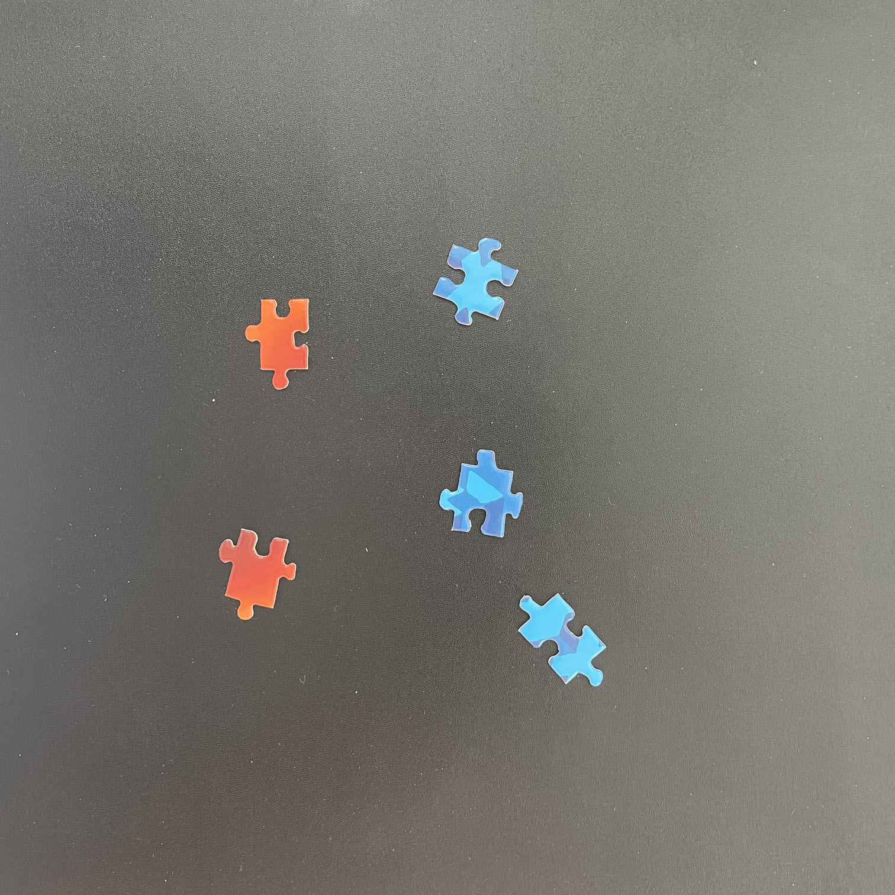
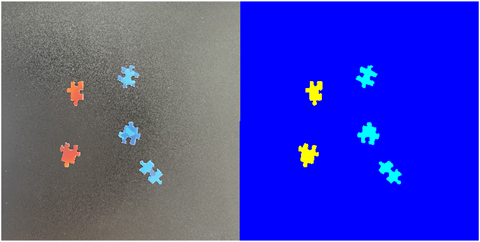
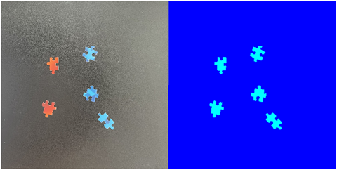
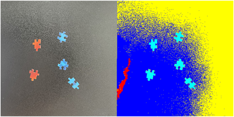
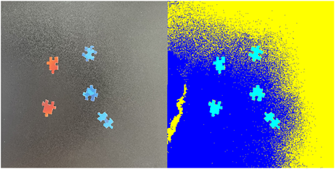

## Advanced Segmentation Approaches

### Question 1

Given two binary masks of puzzle pieces, one that identifies all puzzle pieces ("maskAll") and one that only identifies back-facing puzzle pieces ("maskBack"), how can you combine these masks to obtain only the front- facing puzzle pieces?

- maskAll | ~maskBack
- ~maskAll | maskBack
- **maskAll & ~maskBack**
- maskAll & maskBack

> Correct, This would take all puzzle pieces and only keep those that are not back-facing pieces. This gives us the front-facing pieces. This is the correct choice.

### Question 2

Which of the following of code takes a color image, `img` and uses a binary mask, `BW` to create a masked image?

- maskedImage = img; $\\$
  maskedImage(repmat(~BW,3)) = 0;
- **maskedImage = img; $\\$**
  **maskedImage(repmat(~BW,1,1,3)) = 0;**
- maskedImage = img; $\\$
  maskedImage(repmat(BW,1,1,3)) = 0;
- maskedImage = img; $\\$
  maskedImage(repmat(~BW)) = 0;

  > Correct, This code replicates the binary mask ~BW three times in the third dimension. It makes all the locations corresponding to the logical 0 values in the inverted mask (~BW) to zero in the image, thus masking out those regions. This is the correct option.

### Question 3

Import the image, "Puzzle_06.jpg", found in the course files and convert it to HSV.

Assume you want to differentiate between the red and blue puzzle pieces. Perform K-means clustering to create a
matrix with three labels, one for each color of puzzle piece and the background. Which image below most closely resembles your result?

- 
- 
- 
-  - **ANSWER**

> The variation in the background causes all the puzzle pieces to be assigned to a single label while the background has multiple labels.

### Question 4

Which response below provides the best explanation for the result in the previous question?

- **The variation in the background pixels results in the background being divided into multiple labels rather than separating the puzzle pieces by color.**

> Yes - eliminating background first would be a good first step before applying clustering.

- Because the number of background pixels is so much larger than puzzle pieces, the `imsegkmeans` does not distinguish between the different colored puzzle pieces.
- The `imsegkmeans` function returns a labeled matrix that accurately identifies the background and each color of puzzle piece.
- Four clusters should be used for this image: two for the background variation and one for each color.

### Question 5

Which of the following statement about morphology are true (select all that apply)?

- **you create a structuring element with the `strel` function**

> Correct

- you need to perform spatial filtering before applying morphology
- **you must specify the size and shape of a structuring element**

> Correct

- you can only use morphology when improving segmentation of grayscale images

### Question 6

Assume you want to use a rectangular structuring element with size [3,6] to expand then shrink a foreground mask "BW". Which of the collowing code segments accomplishes this task?

- **se = strel("rectangle",[3,6]); $\\$**
  **BW = imdilate(BW, se); $\\$**
  **BW = imerode(BW, se);**

> This code creates a rectangular structuring element with the specified size, then dilates and erodes the image. This sequence is the correct operation for the closing operation.

- BW = imdilate(BW, "rectangle", [3,6]); $\\$
  BW = imerode(BW, "rectangle", [3,6]);
- se = strel("rectangle",[3,6]); $\\$
  BW = imopen(BW, se); $\\$
  BW = imclose(BW, se);
- se = strel("rectangle") $\\$
  BW = imdilate(BW, se); $\\$
  BW = imerode(BW, se);
