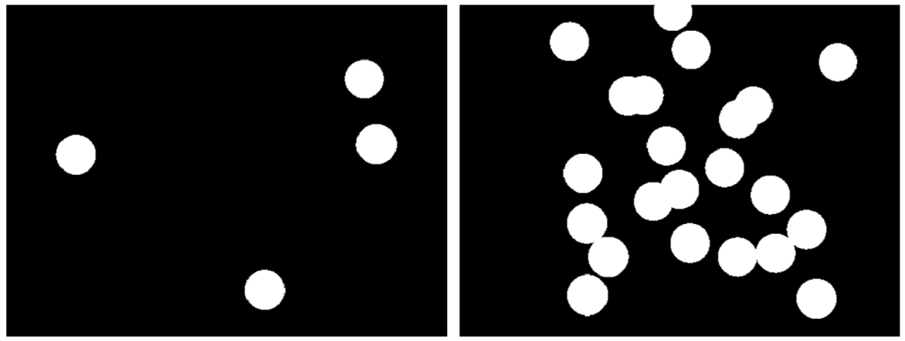

## Concept Check: Advanced Segmentation

### Question 1

Assume you are trying to combine two masks. Which of the following operators can you use when combining the masks?

- or (|)
- And (&)
- All (:)
- At (@)
- Not (~)

### Question 2

Below are two chips masks from the "Combining Multiple Masks" video, which we will refer to here as "MaskLeft" and "MaskRight". How might you combine the masks to get only the background pixels? Select all that apply.

- `~MaskLeft | ~MaskRight`
- `~(MaskLeft | MaskRight()`
- `~MaskLeft & ~MaskRight`
- `~MaskLeft & ~MaskRight`

### Question 3

Consider performing clustering on an image with blue and red objects on a black background. How many clusters should you specify when using `imsegkmeans` function?

- 2
- 3
- 4
- None of the above. The `imsegkemans` function automatically chooses a value of K.
