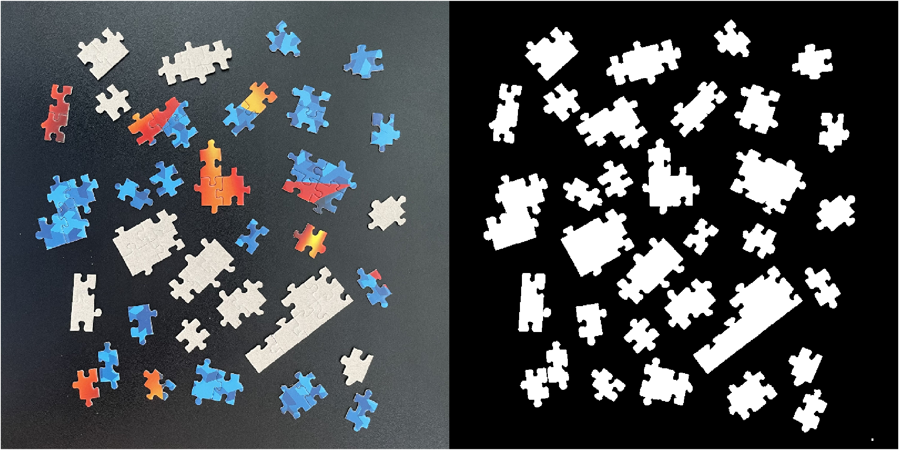

# Analyze Puzzle Region Shape

Consider the following image of puzzle pieces and segmentation mask.

The initial mask above is provided below as puzzleMask. To recreate puzzleMask in MATLAB to develop and test your algorithm, you can download segmentPuzzle34.m, and the image is provided in your course files as Puzzle_34.jpg.

For this problem your code will need to do the following:

- Create a mask which will segment only the regions consisting of 3 joined puzzle pieces (use region filtering to modify the mask created by the provided function). Assign your answer to the variable name threePieceMask.
- Calculate the Area and Eccentricity of each region in threepieceMask. Provide the results in a table variable threePieceProperties.
- Filter the threePiece Mask to include only the regions with three pieces connected in a straight line. Assign the result to threePieceLinearMask. Hint: You can use thresholds for Eccentricity with the bwpropfilt function to isolate the straight-line connected regions in threePieceMask.
- Find the coordinates of a bounding box for each of the regions in threepieceLinearMask. Provide the results in a table variable threePieceLinearBoxes. Hint: Use the regionprops function on threepieceLinearMask with the syntax shown in this example, and the BoundingBox property.
- To apply the bounding boxes to the original image and see the results, uncomment the provided template code.

NOTE: If you use the Image Region Analyzer App in MATLAB, you'll need to generate a function and copy the entire code into the bottom of your solution code here to allow Grader to run it. For code generated from this app, you will also need to add an end to close the generated function before using it in a script. For example:
